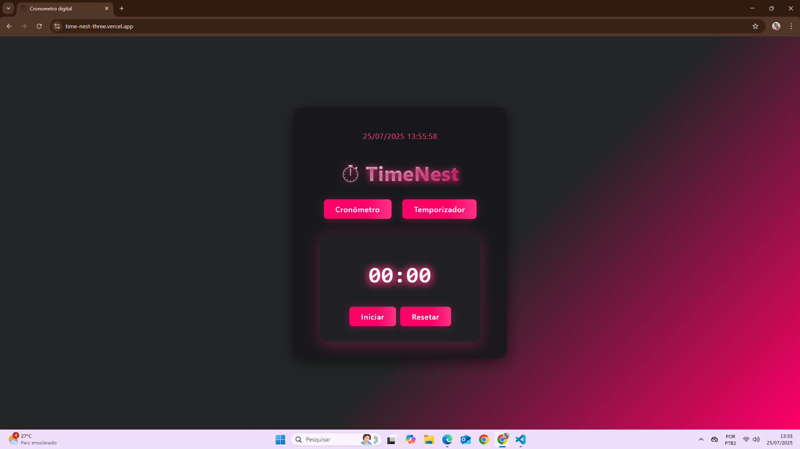

# ⏱️ Cronômetro Moderno

Um cronômetro digital estilizado, responsivo e fácil de usar, desenvolvido em React. Ideal para estudos, esportes ou qualquer atividade que precise de controle de tempo.

## 🚀 Demonstração

[Veja online](time-nest-three.vercel.app) >

## 📸 Preview

 


## ✨ Funcionalidades

- Iniciar, pausar e resetar o cronômetro
- Definir tempo personalizado (minutos e segundos)
- Feedback visual ao finalizar o tempo
- Design moderno com animações e responsividade
- Suporte a dispositivos móveis

## 🛠️ Tecnologias

- React
- CSS moderno (flexbox, animações, gradientes)
- [Opcional] Testes unitários com Jest

## 📱 Responsividade

O layout se adapta a telas pequenas (celulares), garantindo boa usabilidade em qualquer dispositivo.

## 🎨 Customização

Você pode alterar cores, fontes e animações facilmente no arquivo `App.css`.


# ⚡ Como usar

1. Clone o repositório:
   ```
   git clone https://github.com/Silvz67/TimeNest/tree/main
   ```
2. Instale as dependências:
   ```
   npm install
   ```
3. Inicie o projeto:
   ```
   npm start
   ```

## 📝 Melhorias futuras

- Adicionar modo claro/escuro
- Histórico de tempos

## 📄 Licença

Este projeto está sob licença MIT.

---

Feito com 💖 por [Artur Silvz](https://github.com/silvz67)
